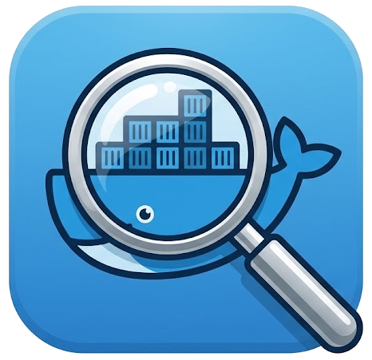

<div align="center">



# Docmon

**A terminal UI for managing and monitoring your Docker stack.**

Docmon is a keyboard-driven, multi-pane TUI that puts your containers, their
live metrics, image freshness, and day-to-day operations one screen away — on
Windows, Linux, and macOS.

[](https://www.nuget.org/packages/Docmon/)
[](LICENSE.md)

**v0.1.0 — Alpha.** This is an early release under active development; features,
behavior, and APIs are subject to change.

</div>

## What it does

Docmon connects to the Docker daemon on the machine it runs on and gives you a
single console for the things you actually do all day:

- **See everything running.** Containers with image, tag, short/full ID, exposed
  ports, state, health, uptime, and live CPU/memory — in a sortable table.
- **Watch performance over time.** CPU, memory, network, and block I/O plotted
  as charts for the whole deployment or for one container.
- **Know when images are stale.** Docmon compares your local image digests
  against the registry and flags what has an update waiting.
- **Group by compose project.** If you live in `compose.yaml` files, Docmon
  understands stacks: it groups containers by project and drives stack-level
  actions.
- **Operate.** Start, stop, restart, kill, pause, and remove containers; pull
  images; prune; and apply an update with one action.
- **Get inside a container.** Run a one-shot command with output captured
  in-pane, transfer files in and out, or open a full interactive shell.

## Screens

Docmon is organized into sections you move between with `Tab` / `Shift+Tab` or
the number keys `1`–`6`:

| # | Screen | What you get |
|---|---|---|
| 1 | **Containers** | The master table plus a live detail pane with inline CPU/memory charts |
| 2 | **Stacks** | Compose projects, their services, and stack-level actions |
| 3 | **Metrics** | Full-size CPU / memory / network / disk charts, overall or per container |
| 4 | **Images** | Local images, registry digests, and update status |
| 5 | **Events** | A live stream of Docker daemon events |
| 6 | **Tools** | Disk usage, prune, and housekeeping |

## Requirements

- The **.NET 8 or .NET 10 SDK** (or the matching runtime, if you install the
  packaged tool). See [Installing the .NET SDK](#installing-the-net-sdk) below.
- A reachable **Docker daemon** on the same host:
  - Windows: the `npipe://./pipe/docker_engine` named pipe (Docker Desktop).
  - Linux/macOS: the `unix:///var/run/docker.sock` socket. Set `DOCKER_HOST` to
    override.
- The `docker` CLI on `PATH` — used only for the interactive shell and TTY exec.

Docmon runs in any modern terminal. For the best rendering, use a terminal with
truecolor and a font that includes box-drawing and block glyphs (Windows
Terminal, iTerm2, most Linux terminals).

## Install

### Installing the .NET SDK

Docmon needs the **.NET 8 or .NET 10 SDK**. Download it from Microsoft:

- All versions: <https://dotnet.microsoft.com/download>
- .NET 10 SDK: <https://dotnet.microsoft.com/download/dotnet/10.0>
- .NET 8 SDK: <https://dotnet.microsoft.com/download/dotnet/8.0>
- Linux, per-distro instructions: <https://learn.microsoft.com/dotnet/core/install/linux>

Quick install by platform:

```bash
# Windows (winget)
winget install Microsoft.DotNet.SDK.10

# macOS (Homebrew)
brew install --cask dotnet-sdk

# Linux (Microsoft install script; installs into ~/.dotnet)
curl -sSL https://dot.net/v1/dotnet-install.sh | bash -s -- --channel 10.0
```

Confirm it is on your `PATH`:

```bash
dotnet --version
```

### Installing Docmon

Docmon ships as a **.NET global tool** named `docmon`. Once installed you can run
`docmon` from any directory.

```bash
dotnet tool install --global Docmon
docmon
```

Global tools install under `~/.dotnet/tools`; if `docmon` is not found, add that
directory to your `PATH` (the tool installer prints the exact path to use).

Building and installing from source:

```bat
git clone https://github.com/jchristn/Docmon.git
cd Docmon
REM Windows convenience scripts (pack + install the 'docmon' command).
REM Both accept an optional target framework: net8.0 or net10.0.
install-tool.bat                 REM auto-selects net10.0 if a .NET 10 SDK is present, else net8.0
install-tool.bat net8.0          REM force .NET 8
reinstall-tool.bat net10.0       REM rebuild and replace an existing install
remove-tool.bat                  REM uninstall
```

The application is multi-targeted for **net8.0** and **net10.0**; the framework
argument selects which runtime the global tool is installed against.

On Linux/macOS the same thing by hand (pick a framework you have installed):

```bash
dotnet pack src/Docmon.App/Docmon.App.csproj -c Release -p:TargetFrameworks=net8.0 -o ./nupkg
dotnet tool install --global --add-source ./nupkg --framework net8.0 Docmon
```

## Usage

```
docmon                 # connect to the local Docker daemon and open the TUI
docmon --no-splash     # skip the startup splash screen
docmon --version       # print version and exit
docmon --help          # print usage and exit
```

Common keys once you're in:

```
Tab / Shift+Tab   move between panes            1..6   jump to a screen
↑ ↓ PgUp PgDn      navigate a table/pane         /      search / filter
Enter              inspect selected              Ctrl+P command palette
s / x / l          shell / exec / logs           F1 / ? help
r S K p            restart / stop / kill / pause  u / U check updates / pull+apply
t                  transfer files                Ctrl+Q quit
```

## How it works

Docmon talks to Docker two ways. Most data and control goes through the Docker
Engine API using [Docker.DotNet](https://github.com/dotnet/Docker.DotNet):
listing, inspecting, stats streaming, lifecycle, image pulls, and archive-based
file transfer. Interactive work that needs a real terminal — opening a shell or
an `exec -it` session — shells out to the `docker` CLI, because a TUI pane can't
host a pseudo-terminal. For those, Docmon suspends its own UI, hands the terminal
to the child process, and restores the dashboard when you exit.

The code is split into a dependency-light `Docmon.Core` library (models,
services, the registry abstraction) and a `Docmon.App` executable that hosts the
[TUIKit](https://www.nuget.org/packages/TUIKit/) interface. Update checks go
through an `IRegistryProvider` interface; Docker Hub ships first, and other
registries slot in behind the same interface.

The full design and roadmap live in [DOCMON.md](DOCMON.md).

## Building

```bash
dotnet build src/Docmon.slnx -c Release
dotnet test  src/Docmon.slnx -c Release
```

The build treats warnings as errors and generates XML documentation.

## License

MIT — see [LICENSE.md](LICENSE.md). Copyright (c) 2026 Joel Christner.
